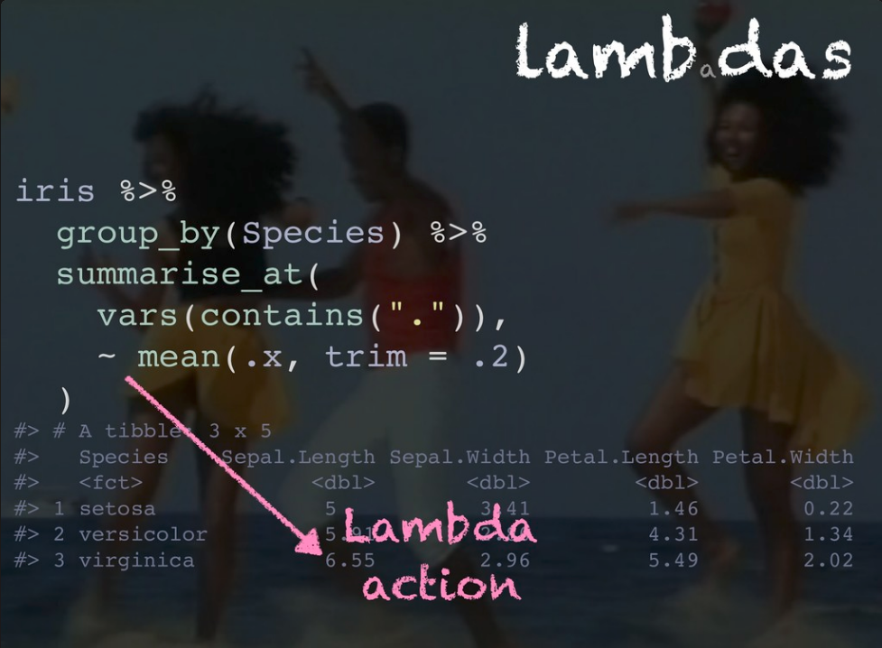
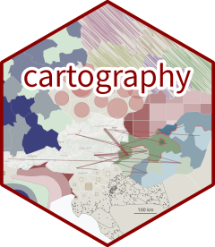
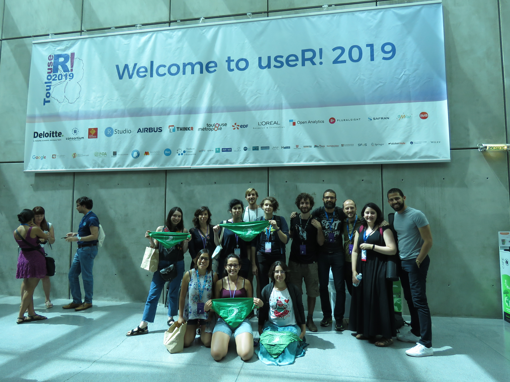
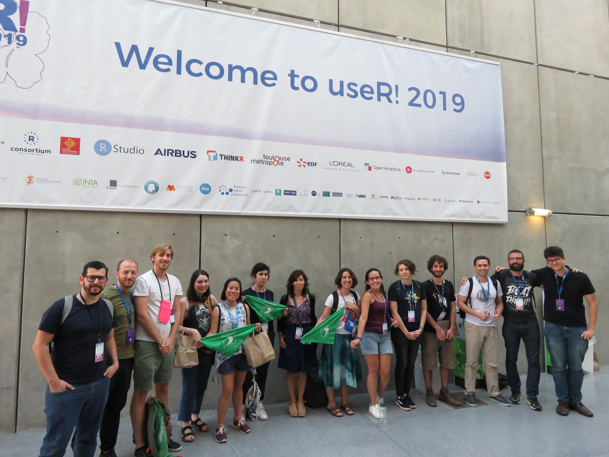

# Parte Koz

## Cómo llegué?

__Bastante casualidad__

__y algo de esfurezo__

- &#x2718; Diversity Scholarship
- &#x2718; [datathon](https://github.com/DiegoKoz/datathonuser2019)
- $\checkmark$ Colaborar con la organización. 

### Y qué hice?

## Hice un tutorial

__Tutorial Package development__
__Instructores__: Jenny Bryan ;  Jim Hester ; Hadley Wickham
[rstd.io/pkg-dev](https://github.com/jennybc/pkg-dev-tutorial)

Vimos:

- $\checkmark$ El workflow básico con Jenny
- $\checkmark$ Cómo hacer testing de la librería con Jim
- $\checkmark$ Cómo armar la documentación y los pasos a seguir para subir las cosas a CRAN con Hadley

__La clave__: la librería [UseThis](https://usethis.r-lib.org/) tiene cientos de funciones para automatizar el proceso. Desde `create_package(path)` que te arma la estructura de carpetas para la librería, hasta `submit_cran()` para subir el paquete a CRAN. 

## Ví charlas

- [`n()` cool dplyr things](https://speakerdeck.com/romainfrancois/n-cool-number-dplyr-things) de @romain_francois explicó algunas funciones exóticas cómo 

{width=250px}
{width=250px}
{width=250px}

Para operar con las variables agrupadas. Estos son algunos atajos para cosas que podríamos hacer con `map()`

## Conocí librerías nuevas

[{width=184px}](https://github.com/dmi3kno/polite)
[{width=184px}](https://usethis.r-lib.org/)
[{width=184px}](https://testthat.r-lib.org/)
[{width=184px}](https://github.com/ThinkR-open/fakir)

[{width=184px}](https://github.com/ThinkR-open/fcuk)
[{width=184px}](https://feasts.tidyverts.org/)
[{width=184px}](https://github.com/riatelab/cartography)
[{width=184px}](https://davidgohel.github.io/flextable/)

## Escuhé keynotes

Joe Cheng (\@jcheng) presentó [__ShinyMeta__](https://github.com/rstudio/shinymeta), en desarrollo, que se propone elaborar shinyapps reproducibles. El objetivo es exportar el código core, __parametrizado__ excluyendo el código asociado a la interactividad de shiny

{width=900px}

## Y nos encontramos unos cuantos latinos dispersos por el mundo!

<!-- {width=400px} -->
{width=600px}

