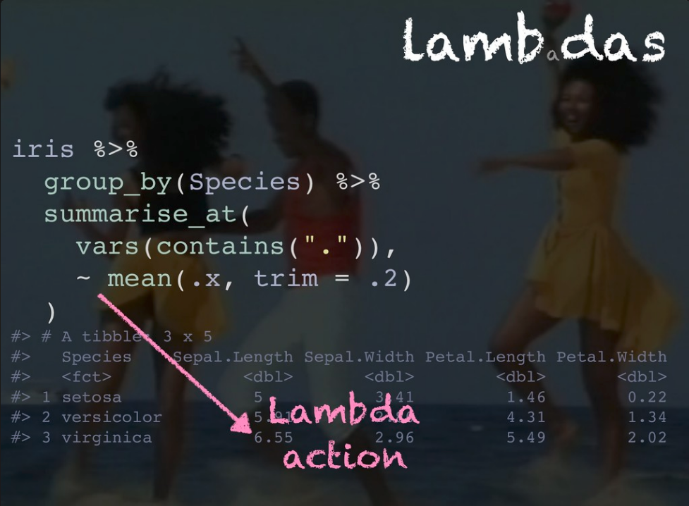

# Parte Koz

Cómo llegué?

## Tutorial Package development

__Instructores__: Jenny Bryan ;  Jim Hester ; Hadley Wickham
[rstd.io/pkg-dev](rstd.io/pkg-dev)

Vimos:

- $\checkmark$ El workflow básico con Jenny
- $\checkmark$ Cómo hacer testing de la librería con Jim
- $\checkmark$ Cómo armar la documentación y los pasos a seguir para subir las cosas a CRAN con Hadley

__La clave__: la librería [UseThis](https://usethis.r-lib.org/) tiene cientos de funciones para automatizar el proceso. Desde `create_package(path)` que te arma la estructura de carpetas para la librería, hasta `submit_cran()` para subir el paquete a CRAN. 

## Charlas copadas

- [`n()` cool dplyr things](https://speakerdeck.com/romainfrancois/n-cool-number-dplyr-things) de @romain_francois explicó algunas funciones exóticas cómo 

{width=250px}
{width=250px}
{width=250px}

## ShinyMeta

Joe Cheng (\@jcheng) presentó en su keynote una librería en desarrollo [__ShinyMeta__](https://github.com/rstudio/shinymeta) que se propone elaborar Shinyapps reproducibles. La idea es que se pueda exportar el código, __parametrizado__ y excluyendo el código que le da la interactividad a Shiny

{width=900px}

